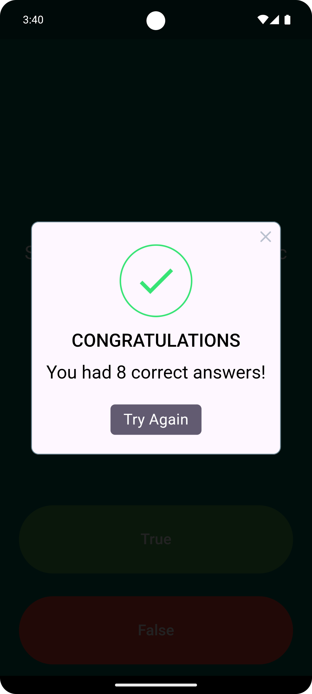

**Quiz App**
=============

A fun quiz app built with Flutter, testing your knowledge and keeping track of your progress.

**Screenshots**
--------------

| | | |
| --- | --- | --- |
| | | |

**Features**
------------

* Engaging quiz questions to test your knowledge
* Two-button interface for easy answering
* History of right and wrong answers displayed at the bottom of the screen
* Responsive design for various screen sizes

**Getting Started**
---------------

To run the app, follow these steps:

1. Clone the repository: `git clone https://github.com/marufimtiaz/flutter-quiz.git`
2. Open the project in your preferred IDE (e.g. Android Studio, Visual Studio Code)
3. Run the app on an emulator or physical device: `flutter run`

**Contributing**
------------

Contributions are welcome! If you'd like to help add more questions, improve the UI, or fix bugs, please open a pull request.

**Author**
------------

[Maruf Imtiaz]